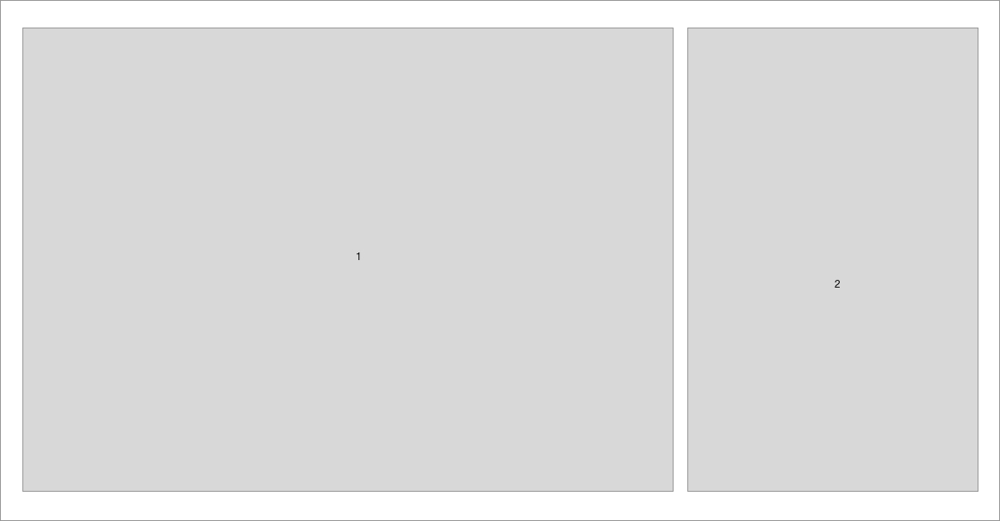
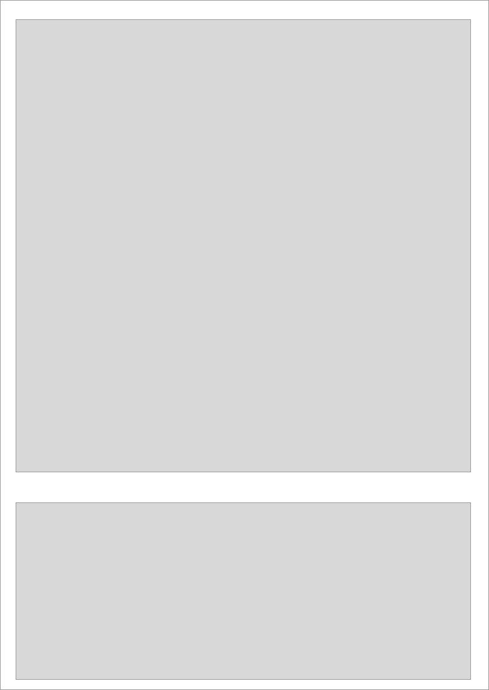
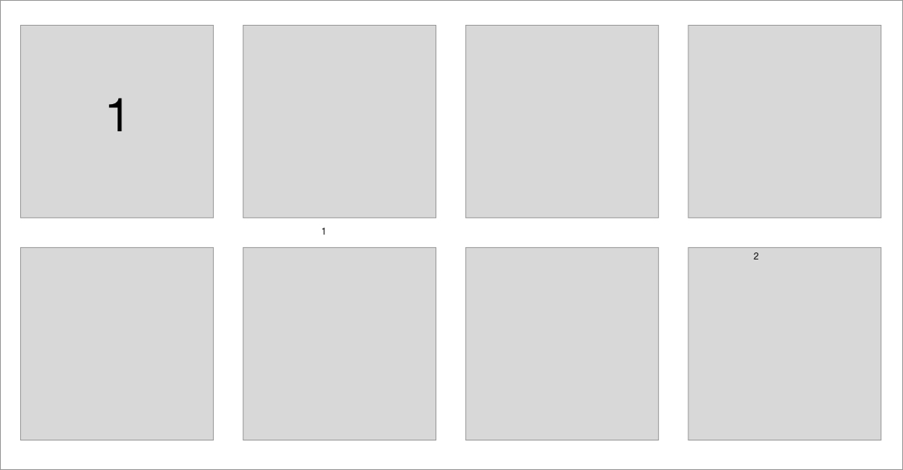

# Work around the Layouts

> layouts est un projet axès sur les techniques de mise en page
> boxes, stacks and composition …

## Layouts a

 - desktop: main / aside en rangé
   - 
 - mobile:  main / aside en colonne
   - 

---

## Layouts b

display:  flex ou grid

- desktop: serie de 8 div
  -  
- mobile:  serie de 8 div dont la premiere div occupe toute la largeur
  -  
  
---